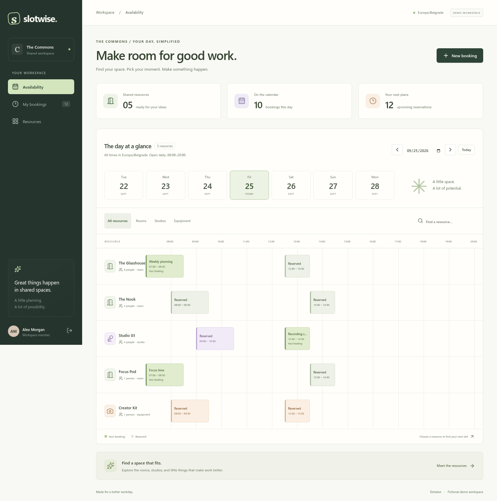

# Slotwise

[](https://github.com/MilanG-Ne/slotwise/actions/workflows/ci.yml)
[](LICENSE)

**Make room for good work.** A small shared-resource booking app built with Laravel, React, TypeScript, and PostgreSQL.

Reserve a meeting room, studio, or equipment kit at a fictional coworking space. Members manage their reservations; admins manage resources. PostgreSQL prevents overlapping bookings even when two writers race to reserve the same space.



## Try it locally

Requires Docker Engine or Docker Desktop with Compose v2. No API keys, mail service, or cloud account needed.

```sh
git clone https://github.com/MilanG-Ne/slotwise.git
cd slotwise
docker compose up --build --wait --wait-timeout 180
```

Open **http://localhost:8080**. The first start runs migrations, generates a private application key, and seeds the fictional workspace. Use the one-click demo buttons or these deliberately public credentials:

| Role | Email | Password |
| --- | --- | --- |
| Member | alex@example.test | demo-password |
| Admin | jordan@example.test | demo-password |

To choose another port: `SLOTWISE_PORT=8088 docker compose up --build --wait`.

```sh
docker compose down             # Stop; keep reservations and the application key
docker compose down --volumes   # Delete this demo's database and stored application key
```

The app binds to `127.0.0.1`; PostgreSQL has no published port. These are local demo settings, not a public hosting configuration.

## A focused first version

- A daily availability board with date navigation, resource filters, and search.
- A responsive mobile agenda and keyboard-accessible native dialogs.
- Reservations in 30-minute increments, up to four hours, within the next 90 days.
- Workspace hours of 08:00–20:00 and explicit workspace time-zone handling.
- Members can cancel their own future bookings. Admins can cancel any future booking and create, edit, or pause resources.
- Other members' booking titles and names are hidden; their occupied times remain visible.
- Optimistic cancellation with rollback on error, followed by server reconciliation.
- A conflict leaves the booking form intact and refreshes availability.

No recurring bookings, payments, email, self-registration, password-reset flow, or multi-workspace tenancy. Those would enlarge a deliberately small project. Personal booking history includes the last 30 days and upcoming reservations, capped at 500 records per response. This is a demonstrator, not a claim of complete production readiness.

## The interesting part: two requests, one room

A “check availability, then insert” sequence can allow two simultaneous requests through. Slotwise uses an exclusion constraint on active reservations:

```sql
EXCLUDE USING gist (
    resource_id WITH =,
    tstzrange(starts_at, ends_at, '[)') WITH &&
) WHERE (cancelled_at IS NULL)
```

The `[)` interval permits one booking to start exactly when another ends. A cancellation keeps the record but releases its occupied interval. A conflicting insert raises SQLSTATE `23P01`, which the API turns into HTTP `409` with a useful message.

The concurrency test opens two real database connections, leaves the first insert uncommitted, and observes the second waiting on a database lock. It verifies both outcomes: the first commit rejects the competitor; the first rollback lets the competitor succeed. SQLite cannot test this invariant.

See [architecture and tradeoffs](docs/architecture.md) for the resource lock, time-zone handling, and session model.

## Development

Requires PHP 8.4 with `pdo_pgsql`, `mbstring`, DOM/XML, and the standard Laravel extensions; Composer 2; Node.js 24; pnpm 11.19.0; PostgreSQL 14+ with `btree_gist` available.

Create two databases, `slotwise` and `slotwise_test`, using a role that can create the extension in those databases. On managed PostgreSQL, an administrator may need to enable it first.

```sh
cd backend
cp .env.example .env
# Edit DB_* to match your local database.
composer install
php artisan key:generate
php artisan migrate --seed
php artisan serve --host=127.0.0.1 --port=8084
```

In another terminal, from the repository root:

```sh
pnpm install --frozen-lockfile
pnpm build
```

Open http://127.0.0.1:8084. For React hot reload, run `pnpm dev` and open http://127.0.0.1:3004/build/; Vite proxies `/api` to port 8084.

```sh
# Backend tests use PostgreSQL, never the demo database.
cd backend
DB_DATABASE=slotwise_test vendor/bin/phpunit
vendor/bin/pint --test

# Frontend helpers and the real HTTP/browser flow (from repo root)
pnpm test
pnpm exec playwright install chromium
pnpm test:e2e
```

For browser tests against Docker: `E2E_URL=http://127.0.0.1:8080 pnpm test:e2e`. Run browser tests only against a disposable, freshly seeded demo: they create reservations and an admin resource. CI builds the actual Docker image and runs this flow through Apache and PostgreSQL 16.

## Repository map

- `backend/app/Services/BookingService.php` — reservation transaction and conflict translation.
- `backend/database/migrations/` — PostgreSQL invariant and schema.
- `backend/tests/Feature/ConcurrencyTest.php` — independent-writer race test.
- `frontend/components/` — schedule, forms, and dialogs.
- `frontend/App.tsx` — authenticated workspace and query/mutation coordination.
- `tests/workspace.spec.ts` — browser workflows and HTTP security boundary checks.

[Security and hosting notes](SECURITY.md) · [Changelog](CHANGELOG.md) · [MIT license](LICENSE)
